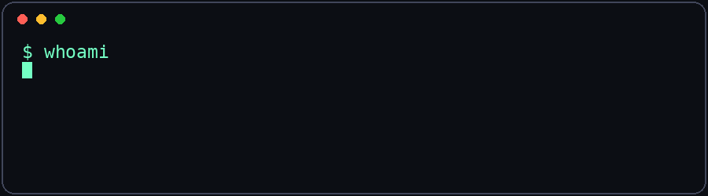
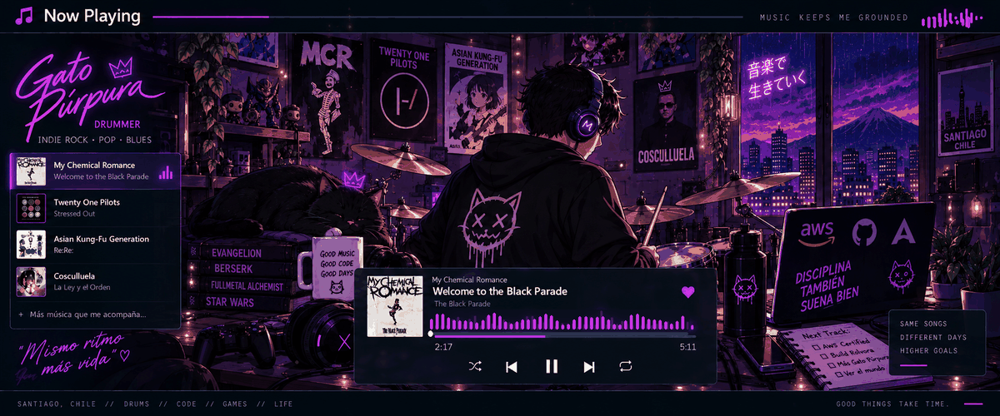

<div align="center">


# 👋 Hola, soy Matías Pérez

### QA Engineer · Ingeniero en Informática · Cloud & AWS ☁️

[](https://www.linkedin.com/in/matiasperezsilva/)
[](mailto:matiasreinaldop@gmail.com)


</div>

---

## 🧠 `$ whoami`



Soy **Ingeniero en Informática** con experiencia en **Quality Assurance, testing de software, bases de datos y operaciones TI**.

Durante mi experiencia en QA he trabajado en proyectos de migración tecnológica, ejecutando **pruebas funcionales, de regresión, integración y UAT**, además de diseñar casos de prueba, documentar hallazgos y colaborar con equipos técnicos y usuarios finales.

Actualmente estoy ampliando mi perfil hacia **Cloud Computing y AWS** a través de **AWS re/Start — Generation Chile**.

- 🔭 Enfocado en **QA + Cloud**
- ☁️ Aprendiendo **AWS, Linux, Networking y Security**
- 🐍 Practicando **Python**
- 🧪 Me interesa crecer en **automatización de pruebas**
- 🥁 Fuera del teclado, probablemente estoy tocando batería
- 🎮 También me gustan los videojuegos, el anime y la ciencia ficción

<br clear="right"/>

---

## ⚙️ Tech Stack

<div align="center">

### ☁️ Cloud & Systems


### 💻 Code & Data


### 🧪 QA & Tools


</div>

---

## 🧪 Quality Assurance

```text
Functional Testing   ███████████████████░
Regression Testing   ███████████████████░
Integration Testing  ██████████████████░░
UAT                  ███████████████████░
Test Case Design     ███████████████████░
Automation           ████████░░░░░░░░░░░░  learning...
```

`Manual Testing` · `Functional Testing` · `Regression Testing` · `Integration Testing`  
`User Acceptance Testing` · `Test Case Design` · `Defect Tracking` · `Bug Reporting`

---

## ☁️ Current Mission

```yaml
current_focus:
  program: AWS re/Start
  organization: Generation Chile

learning:
  - AWS
  - Linux
  - Networking
  - Security
  - Databases
  - Python
  - Automation

goal:
  - build a stronger Cloud profile
  - combine software quality with cloud technologies
```

---

## 🚀 Featured Projects

### 🔮 Rolvora
Plataforma web para facilitar la búsqueda, análisis y gestión de oportunidades laborales.

`Next.js` `React` `Supabase` `AI` `APIs`

### 🪟 CityGlass
Proyecto de digitalización para una empresa chilena del rubro de ventanas y termopaneles.

`Web Development` `Business Tools` `UI/UX`

### ☁️ AWS Labs
Laboratorios y ejercicios prácticos de mi formación AWS re/Start.

`AWS` `Linux` `Networking` `Cloud`

---

## 🎵 Now Playing

<div align="center">



</div>


---


## 🎧 Outside Tech

<div align="center">

🥁 **Drummer** · 🎸 Indie / Rock / Post-Hardcore · 🎮 Gaming

`Evangelion` · `Berserk` · `Fullmetal Alchemist` · `Star Wars` · `Harry Potter`

<br/>

*"Build it. Break it. Test it. Learn from it."*

</div>

---

<div align="center">

### 🤝 Conectemos

[](https://www.linkedin.com/in/matiasperezsilva/)
[](https://github.com/matiasperezsilva)

**From QA to Cloud — one commit at a time. ☁️**

</div>
